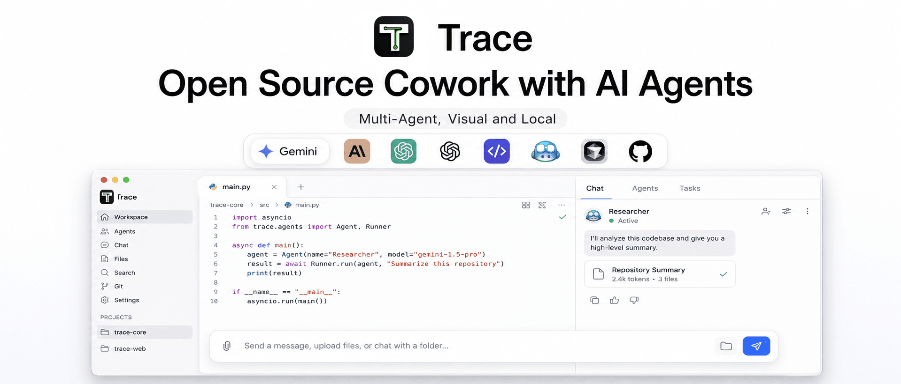
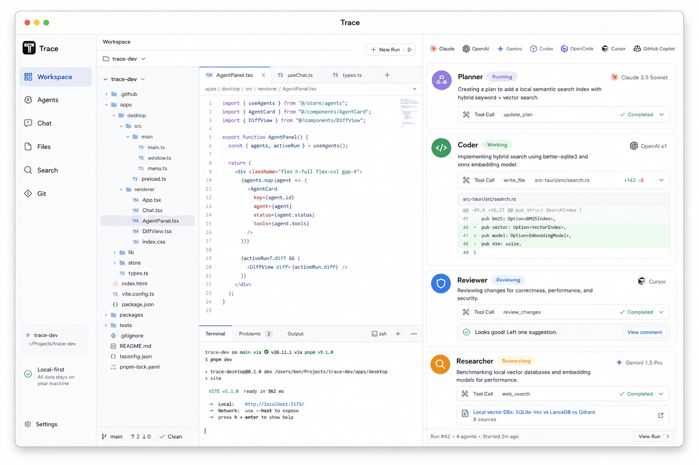
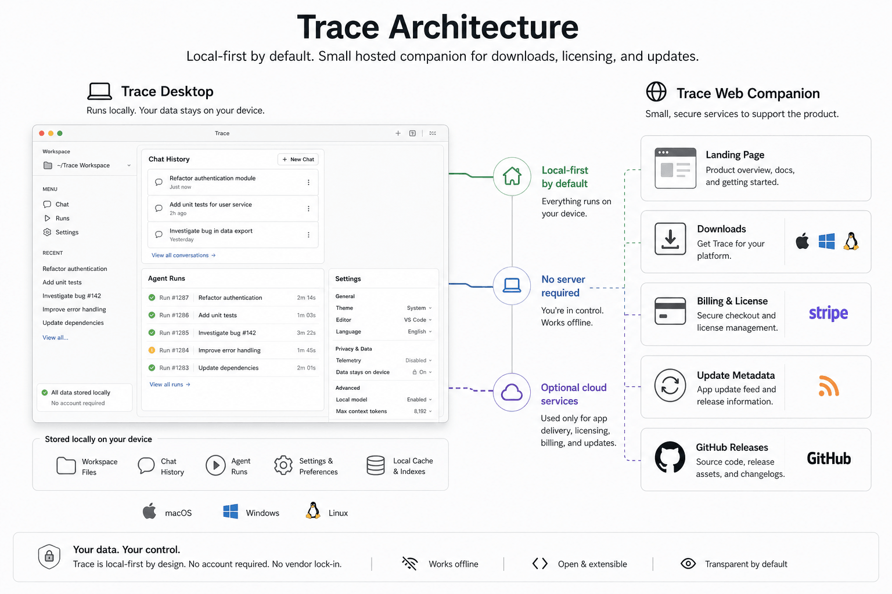

<p align="center">
  
</p>

<p align="center">
  
  
  
</p>

<p align="center">
  <strong>Trace is a local-first desktop app for working with AI agents.</strong><br>
  Run built-in and external agents, manage files, use skills and MCP tools, automate tasks, and keep control on your machine.
</p>

<p align="center">
  <a href="https://github.com/drewsephski/trace-ai/releases">
    
  </a>
</p>

## What Trace Is

Trace is a cross-platform Electron desktop app that gives AI agents a visual, local workspace. It is not just a chat window: agents can read and write project files, use tools, run multi-step workflows, and ask for approval when needed.

The desktop app is designed to work local-first. Core usage does not require a hosted server. GitHub Releases provide desktop downloads and update metadata; a separate hosted web app is optional for landing pages, license/billing, or account features.

<p align="center">
  
</p>

## Core Concepts

- **Local-first desktop app**: your workspace and app runtime stay on your machine by default.
- **Built-in agent runtime**: install the app, add an API key, and start using agent workflows.
- **Multi-agent support**: connect tools such as Claude Code, Codex, Qwen Code, OpenCode, Gemini, Hermes Agent, Cursor Agent, and other compatible runtimes through one interface.
- **Files and workspaces**: attach files, chat with folders, preview generated files, and let agents work against real project context.
- **Assistants and skills**: use built-in assistants for coding, documents, spreadsheets, presentations, research, planning, and custom workflows; extend them with reusable skills.
- **MCP tools**: configure Model Context Protocol servers once and use them across supported agents.
- **Team mode**: coordinate multiple agents through a leader/teammate workflow with shared workspace context.
- **WebUI and channels**: expose a local WebUI or connect messaging channels when you intentionally want remote access.
- **Scheduled automation**: run recurring or unattended tasks while keeping the desktop app in control.

## Installation

Download the latest signed build from [GitHub Releases](https://github.com/drewsephski/trace-ai/releases).

Supported platforms:

- macOS
- Windows
- Linux

After installation:

1. Open Trace.
2. Add an API key or configure a local/provider endpoint.
3. Choose an assistant or agent runtime.
4. Attach files or open a workspace folder.
5. Approve tool actions as needed.

## Local-First Behavior

Trace should continue to be useful without any hosted backend:

- Desktop app runtime runs locally.
- Workspace files remain local unless you explicitly connect remote services.
- WebUI is optional and can run from the local app.
- GitHub Releases are enough for publishing installers and auto-update metadata.

A hosted web app can be added later for:

- marketing/landing page
- downloads page
- billing and license checkout
- account or license validation
- custom update metadata if GitHub Releases stops being enough

<p align="center">
  
</p>

## Development

This repo uses Bun.

```bash
bun install
bun run dev
```

Useful checks:

```bash
bun run format
bun run format:check
bun run lint:fix
bunx tsc --noEmit
bun run test
```

If renderer text or locale files change, also run:

```bash
bun run i18n:types
node scripts/check-i18n.js
```

## Releases

Desktop releases are published through GitHub Releases.

Typical flow:

```bash
git tag v1.0.0
git push origin v1.0.0
```

The release workflow builds desktop artifacts and uploads installer/update metadata. Signed and notarized production builds require the appropriate GitHub Actions secrets for Apple and Windows code signing.

## Repository Layout

- `packages/desktop/`: Electron desktop app.
- `packages/web-host/`: local WebUI host/runtime support.
- `packages/web-cli/`: standalone WebUI CLI packaging.
- `packages/shared-scripts/`: shared build and packaging helpers.
- `scripts/`: release, install, build, and maintenance scripts.
- `tests/`: unit, integration, and e2e coverage.
- `resources/`: app icons, README assets, release resources, and packaged runtime assets.

## Compatibility Notes

Some internal package names, protocol identifiers, backend contracts, and legacy environment variables are compatibility surfaces and should not be renamed casually. User-facing product identity should be Trace.

## Links

- [Releases](https://github.com/drewsephski/trace-ai/releases)
- [Issues](https://github.com/drewsephski/trace-ai/issues)
- [Discussions](https://github.com/drewsephski/trace-ai/discussions)
- [Wiki](https://github.com/drewsephski/trace-ai/wiki)

## License

Apache-2.0. See [LICENSE](./LICENSE).
